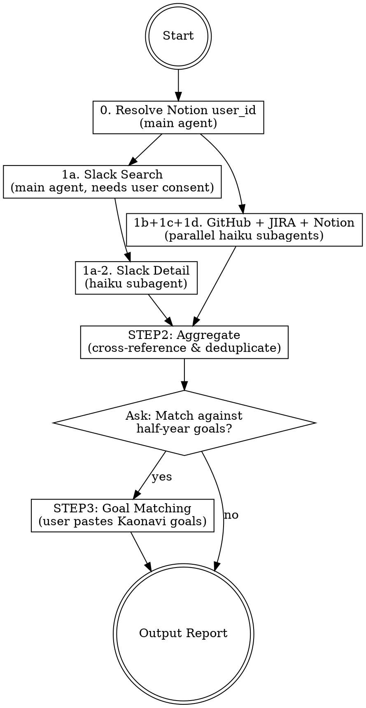

# Achievement Collector

Collect and organize work achievements from Slack, GitHub, JIRA, and Notion over a configurable period, then optionally match them against Kaonavi half-year goals.

## Required Input

- **Period**: Date range to collect achievements (default: last 1 month from today)
- User can specify: "直近3ヶ月", "2026-01 to 2026-03", "last quarter", etc.

Compute exact `SINCE_DATE` and `UNTIL_DATE` at runtime based on today's date.

## Execution Flow



## STEP 0: Resolve Notion User ID

Before starting collection, resolve the user's Notion user_id. This is needed for the Notion collection step.

Run in the main agent:
```
notion-search with query: "okamoto yosuke", query_type: "user"
```

Find the matching user entry (email: okamoto.yosuke@moneyforward.co.jp) and extract the user ID.
Known ID: `ad0f1d7f-86bd-4f76-b250-436c109f4476` (okamotoyosuke)

If the user has changed, re-resolve. Cache the ID for the session.

## STEP 1: Collection

### 1a. Slack Collection (Main Agent + Subagent)

**IMPORTANT:** Slack MCP search tools require user consent (marked as "user action"). They CANNOT run inside subagents because the consent prompt won't reach the user. Therefore, Slack collection is split into two phases.

**Phase 1: Search (Main Agent)**

The main agent runs Slack searches directly (so user can approve):

1. Search messages FROM the user:
   `slack_search_public_and_private` with query: `from:@me after:{SINCE_DATE} before:{UNTIL_DATE}`

2. Search messages mentioning the user:
   `slack_search_public_and_private` with query: `to:me after:{SINCE_DATE} before:{UNTIL_DATE}`

Save the raw search results (channel, timestamp, snippet, permalink for each message).

**Phase 2: Detail Reading (Haiku Subagent)**

Pass the search results to a haiku subagent for thread reading and summarization. Thread/channel reading also requires user consent, so if the subagent fails on `slack_read_thread`/`slack_read_channel`, fall back to using the search result snippets as-is.

**Subagent prompt template:**

```
You are a helper that organizes Slack search results into a structured report.

## Input Data

Here are the raw Slack search results for the period {SINCE_DATE} to {UNTIL_DATE}:

### Messages from the user:
{RAW_FROM_ME_RESULTS}

### Messages mentioning the user:
{RAW_MENTION_RESULTS}

## Task

1. For each message result:
   - Record: channel name, date, message snippet
   - Try to use slack_read_thread to get thread context and write a 1-2 sentence summary
   - If slack_read_thread fails (permission error), use the snippet as-is
   - If the message is NOT in a thread, try slack_read_channel to read ~5 surrounding messages for context. If that also fails, use the snippet as-is.

2. Group messages by topic/channel where possible.
3. Deduplicate: if the same thread appears in both "from me" and "mentions", merge them.

## Output Format

Return EXACTLY this YAML structure:

```yaml
slack_activity:
  from_me:
    - channel: "#channel-name"
      date: "YYYY-MM-DD"
      summary: "Brief description of what was discussed"
      is_thread: true/false
      thread_summary: "Thread context summary (if available)"
      permalink: "slack message link if available"
  mentions:
    - channel: "#channel-name"
      date: "YYYY-MM-DD"
      from: "person name"
      summary: "What they said/asked regarding me"
      is_thread: true/false
      thread_summary: "Thread context summary (if available)"
      permalink: "slack message link if available"
```
```

**Fallback:** If Slack search also fails in the main agent (e.g., workspace restrictions), ask the user to specify key channels and use `slack_read_channel` with date range to read them directly.

### 1b. GitHub Subagent (Parallel with JIRA + Slack Detail)

Launch GitHub and JIRA subagents in parallel using `model="haiku"`. Also launch the Slack detail subagent in parallel if Slack search results are ready.

**Prompt template:**

```
You are a helper that collects GitHub activity for a user in the moneyforward org.

## Task

Collect PRs and comments from {SINCE_DATE} to {UNTIL_DATE}.

1. Search PRs created by the user:
   gh search prs --author @me --created "{SINCE_DATE}..{UNTIL_DATE}" --owner moneyforward --limit 50 --json title,state,closedAt,mergedAt,url,number,repository,body

2. Search PRs where the user commented:
   gh search prs --commenter @me --updated "{SINCE_DATE}..{UNTIL_DATE}" --owner moneyforward --limit 50 --json title,state,url,number,repository

3. Search PRs where the user was requested as reviewer:
   gh search prs --review-requested @me --updated "{SINCE_DATE}..{UNTIL_DATE}" --owner moneyforward --limit 30 --json title,state,url,number,repository

4. For each authored PR:
   - Categorize: merged, open, closed (not merged)
   - Extract: repo name, PR title, PR number, URL, merge date

5. For commented/reviewed PRs (exclude self-authored duplicates):
   - Note the repo and PR title

## Output Format

Return EXACTLY this YAML structure:

```yaml
github_activity:
  authored_prs:
    - repo: "moneyforward/repo-name"
      pr_number: 123
      title: "PR title"
      url: "https://github.com/..."
      state: "merged/open/closed"
      merged_at: "YYYY-MM-DD or null"
      summary: "1-line summary from PR body"
  reviewed_prs:
    - repo: "moneyforward/repo-name"
      pr_number: 456
      title: "PR title"
      url: "https://github.com/..."
      role: "reviewer/commenter"
  commented_prs:
    - repo: "moneyforward/repo-name"
      pr_number: 789
      title: "PR title"
      url: "https://github.com/..."
```
```

### 1c. JIRA Subagent

**IMPORTANT:** Use the acli-jira plugin wrapper script for all JIRA operations. Invoke `Skill("acli-jira:operating-jira")` first to get the script path and usage patterns.

**Prompt template:**

```
You are a helper that collects JIRA tickets for a user.

## Prerequisites

First, invoke the skill: Skill("acli-jira:operating-jira") to learn how to use the JIRA CLI wrapper script.

The wrapper script is located at:
/Users/okamoto.yosuke/.claude/plugins/cache/mf-claude-plugins/acli-jira/d7ccf9b6b918/skills/operating-jira/scripts/jira-acli.sh

Use this script (referred to as JIRA_CLI below) for all JIRA operations.

## Task

Search for tickets assigned to the current user in projects NTP and API.

1. Search DONE tickets in the period:
   Run: JIRA_CLI search "project in (NTP, API) AND assignee = currentUser() AND statusCategory = Done AND updated >= '{SINCE_DATE}' ORDER BY updated DESC"

2. Search in-progress or recently updated tickets (for context):
   Run: JIRA_CLI search "project in (NTP, API) AND assignee = currentUser() AND statusCategory != Done AND updated >= '{SINCE_DATE}' ORDER BY updated DESC"

3. For each ticket that needs more detail, view it:
   Run: JIRA_CLI view NTP-123

4. For each ticket, extract:
   - Ticket key (e.g., NTP-123, API-456)
   - Summary
   - Status
   - Story points (if set)
   - Parent/Epic link (if any)
   - Resolution date

Note: NTP may use custom status names with emoji prefixes (e.g., "✅Done"). Use statusCategory for filtering. If statusCategory doesn't work, fall back to listing all statuses.

## Output Format

Return EXACTLY this YAML structure:

```yaml
jira_activity:
  done_tickets:
    - key: "NTP-123"
      summary: "Ticket summary"
      status: "Done"
      story_points: 5
      epic: "NTP-100 or null"
      resolved_date: "YYYY-MM-DD"
  in_progress_tickets:
    - key: "API-456"
      summary: "Ticket summary"
      status: "In Progress"
      story_points: 3
      epic: "API-200 or null"
```
```

### 1d. Notion Collection (Main Agent — two-phase search)

**IMPORTANT:** Notion MCP tools (like Slack MCP) may require user consent and CANNOT reliably run inside subagents. Run ALL Notion searches in the main agent. This step should be executed in parallel with the Slack search (1a), while GitHub (1b) and JIRA (1c) subagents run concurrently.

Notion collection uses a **two-phase approach** to accurately identify pages created by the user.

**Phase 1: AI Search (broad, semantic)**

Run multiple AI Search queries covering the user's work domains. AI Search returns semantically related results from Notion AND connected sources (Slack, GitHub, etc.), but `created_by_user_ids` filter is NOT reliable in this mode — unrelated pages may be included.

```
notion-search with:
  query: "<domain-specific keywords from user's GIs/work areas>"
  query_type: "internal"
  filters: { created_by_user_ids: ["{NOTION_USER_ID}"], created_date_range: { start_date: "{SINCE_DATE}", end_date: "{UNTIL_DATE}" } }
  page_size: 25
  max_highlight_length: 150
```

Run 3-5 queries with different keyword sets to maximize coverage. Collect all unique Notion page IDs and titles from the results (ignore Slack/GitHub results — those are covered by other steps).

**Phase 2: workspace_search (strict, keyword-based)**

For each keyword set, re-run with `content_search_mode: "workspace_search"`. This mode enforces `created_by_user_ids` strictly and only returns pages actually created by the user.

```
notion-search with:
  query: "<same keywords>"
  query_type: "internal"
  content_search_mode: "workspace_search"
  filters: { created_by_user_ids: ["{NOTION_USER_ID}"], created_date_range: { start_date: "{SINCE_DATE}", end_date: "{UNTIL_DATE}" } }
  page_size: 25
  max_highlight_length: 100
```

**Cross-reference:** Only pages that appear in the workspace_search results are confirmed as user-authored. Pages that appeared only in AI Search but not in workspace_search should be discarded (they are likely authored by others but semantically related).

**Output format:**

```yaml
notion_activity:
  authored_pages:
    - title: "Page title"
      url: "https://www.notion.so/..."
      date: "YYYY-MM-DD"
      highlight: "Brief description from search highlight"
```

**Known limitations:**
- `workspace_search` is keyword-based, not semantic. Pages with unusual titles may be missed. Use multiple keyword variations.
- There is NO filter for "updated by" or "commented by" — only "created by" is supported.
- `notion-get-comments` currently returns empty results, likely due to the Notion MCP integration lacking "Read comments" permission. Pages the user commented on (but did not create) cannot be identified via API at this time.
- `notion-fetch` metadata does NOT include creator/updater user IDs, so fetching individual pages cannot be used to verify authorship either.

## STEP 2: Aggregation

After all subagents return (Slack, GitHub, JIRA, Notion), the main agent (opus) cross-references and groups results.

### Grouping Logic

The typical work lifecycle is:
1. JIRA ticket created (or assigned)
2. Slack discussion/design consultation
3. GitHub PR(s) created for implementation
4. Slack review request / discussion
5. PR merged, JIRA marked Done

**Cross-reference heuristics:**
- Match JIRA ticket keys mentioned in PR titles/bodies (e.g., "NTP-123" in PR title)
- Match JIRA ticket keys mentioned in Slack messages
- Match PR URLs shared in Slack messages
- Match Notion page topics with JIRA tickets, PRs, or Slack discussions (e.g., a design doc in Notion related to a JIRA epic)
- Match by topic similarity (same feature name across sources)
- Group Slack messages about the same PR or JIRA ticket

### Output Format

Present grouped achievements as:

```markdown
## Achievement Summary ({SINCE_DATE} ~ {UNTIL_DATE})

### Achievement 1: [Descriptive title]
**Sources:**
- JIRA: NTP-123 "Implement X feature" (Done, 5pts)
- GitHub: moneyforward/repo#456 "Add X feature" (merged 2026-03-15)
- Slack: #channel-name - discussed design on 2026-03-01, review request on 2026-03-10
- Notion: "Design Document for X" (created 2026-03-05) https://notion.so/...

**Summary:** 1-3 sentence description of what was accomplished.

### Achievement 2: ...

### Uncategorized Items
Items that couldn't be grouped into a specific achievement.
```

## STEP 3: Half-Year Goal Matching (Optional)

After presenting STEP 2 results, ask the user:

> "半期目標とのマッチングも行いますか？ / Would you also like to match achievements against your half-year goals?"

If yes:

> "Kaonaviの半期目標をそのまま貼り付けてください。 / Please paste your Kaonavi half-year goals as-is."

After receiving the goals, parse Goal Indicators (GI1, GI2, GI3, ...) and their descriptions, then:

1. For each achievement from STEP 2, determine the best-matching GI based on:
   - Action Plan descriptions
   - Goal Indicator descriptions
   - Keywords and context overlap

2. Output a categorized report:

```markdown
## Goal Achievement Mapping

### GI1: [Goal Indicator title] (weight: XX%)
- Achievement A: ...
- Achievement B: ...

### GI2: [Goal Indicator title] (weight: XX%)
- Achievement C: ...

### GI3: [Goal Indicator title] (weight: XX%)
- Achievement D: ...

### Extra (not mapped to any GI)
- Achievement E: ...
```

## Common Issues

- **Slack search permission denied in subagent**: Slack MCP tools require user consent ("user action"). They must be called from the main agent, NOT from subagents. The skill handles this by running search in the main agent and delegating only detail reading/summarization to subagents.
- **Slack read also fails in subagent**: `slack_read_thread` and `slack_read_channel` may also require user consent. If so, fall back to using search result snippets without thread expansion.
- **Slack rate limits**: If search returns too many results, narrow with channel filters or date ranges
- **JIRA auth**: If acli fails, run the wrapper script's `auth-login` command to re-authenticate via OAuth
- **GitHub org scope**: Always use `--owner moneyforward` to scope searches
- **Date format**: acli uses `'YYYY-MM-DD'` with quotes; gh uses `YYYY-MM-DD..YYYY-MM-DD`
- **Notion MCP requires main agent**: Like Slack MCP, Notion MCP tools may require user consent ("user action"). They must be called from the main agent, NOT from subagents. Run both Phase 1 (AI Search) and Phase 2 (workspace_search) in the main agent.
- **Notion AI Search vs workspace_search**: AI Search (`content_search_mode` omitted or `"ai_search"`) is semantic but does NOT strictly enforce `created_by_user_ids` — unrelated pages leak in. Always cross-reference with `workspace_search` mode which enforces the filter strictly but only does keyword matching.
- **Notion comments not retrievable**: `notion-get-comments` returns empty for all pages (as of 2026-04). Likely cause: the Notion MCP integration lacks "Read comments" permission. Pages the user commented on but did not create cannot be identified. This is a known limitation — do not waste API calls trying to check comments.
- **Notion fetch lacks author metadata**: `notion-fetch` does not return creator or last-editor user IDs in metadata. Cannot verify page authorship by fetching individual pages.
- **Notion search keyword coverage**: `workspace_search` is keyword-based. Run 3-5 queries with varied keywords derived from the user's GIs/work areas to maximize coverage. A page with an unrelated title may be missed.
