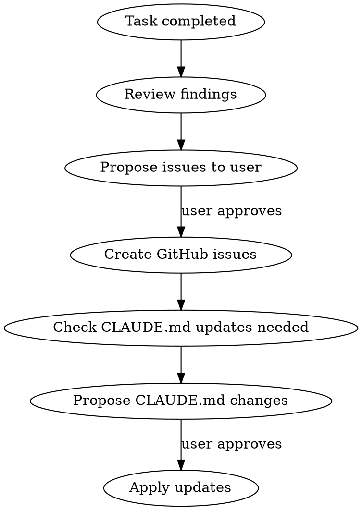

# Post-Task Review

## Overview

After completing significant work, review the codebase for issues discovered during the task, register them as GitHub issues, and update CLAUDE.md with knowledge that helps future sessions.

## When to Use

- After completing a bug fix, feature, or investigation
- When the user says work is done, asks to wrap up, or asks for a review
- After touching multiple files and gaining codebase insight

Do NOT use for trivial changes (typo fixes, single-line edits).

## Workflow

### 1. Review Findings

Identify issues discovered during work. Categories to check:

- **Duplicated logic**: Same business logic in multiple files
- **Inconsistent patterns**: Different approaches to the same problem across files
- **Missing tests**: Untested critical paths found during investigation
- **Missing indexes / schema issues**: DB performance risks
- **Tight coupling**: Components that should be separated
- **Type safety gaps**: `any` types, loose interfaces

Present a prioritized summary to the user. Ask if they want issues created.

### 2. Create GitHub Issues

Use `gh issue create` for each approved item. Each issue must include:

- **Summary**: What the problem is, with specific file paths and line numbers
- **Proposed Solution**: Concrete direction, not vague suggestions
- **Priority**: Why it matters (data integrity, performance, maintainability)

Use appropriate labels (`bug` for correctness issues, `enhancement` for improvements).

### 3. Update CLAUDE.md

Check if the work revealed knowledge that would reduce future investigation time:

- **Architecture notes**: How subsystems connect, data flow, key design decisions
- **Duplication risks**: List of files that must be updated together
- **Testing setup**: How to run tests, where test files live
- **Field semantics**: What DB fields actually mean (especially if non-obvious)

Propose specific additions to the user before editing.

## What NOT to Do

- Do not create issues without user approval
- Do not add speculative or hypothetical issues
- Do not update CLAUDE.md with information already documented
- Do not add generic best practices — only project-specific knowledge discovered during the task
